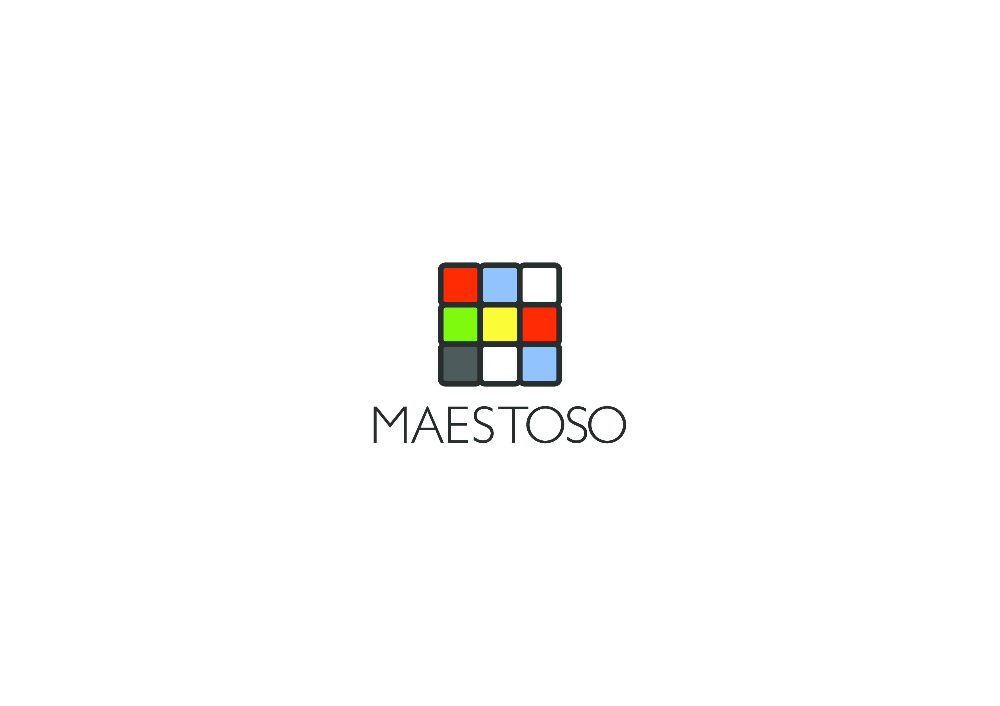

# Maestoso

   
  </a>

## An Open Source Music Animation Software

Maestoso creates stunning 2D Animations directly from MIDI files. It currently features 7 customizable themes pertaining to 4 seperate categories of musical information: **Rhythm, Harmony, Melody and Polyphony**. This software also offers in-built methods that make retrieval of MIDI information easy and straightforward, making it easy for contributors to solely focus on theme construction. 

   
  </a>

## Maestoso 2.0 is coming soon! 

Maestoso initially began with an idea for a software that allowed users to construct their own music animations in a way that gave them enough control to create anything that they could possibly imagine whilst letting the software do all the heavy lifting in terms of syncronisation, information retrieval and coordination of musical information. The current version of Maestoso was a bit of a sidetrack while I was working on the original software. This version borrows many functions from Maestoso 2.0 but doesn't offer the intended flexibility and instead retricts the user to a set of themes. **All of that will change soon!** 

### Some of the features currently being developed for Maestoso 2.0: 
- Give the users more power with themes by letting them design the themes themeselves without having to write a single line of code 
- Methods that tackle ornamentations and articulations more accurately and creatively 
- Support for lyrics: bind text to other musical features and have more control 
- Advanced harmonic analysis and manipulations: retrieve information specific to chord functions and provide methods to manipulate animations to them 
- Support for different musical forms: support for musical forms such as fugues, raps and etc where their distinctive stylistic traits are better highlight, i.e, rhyme scheme analysis, melodic transformations and etc can be better animated. 

## Documentation 
The official documentation is hosted on [ReadTheDocs](https://github.com).

